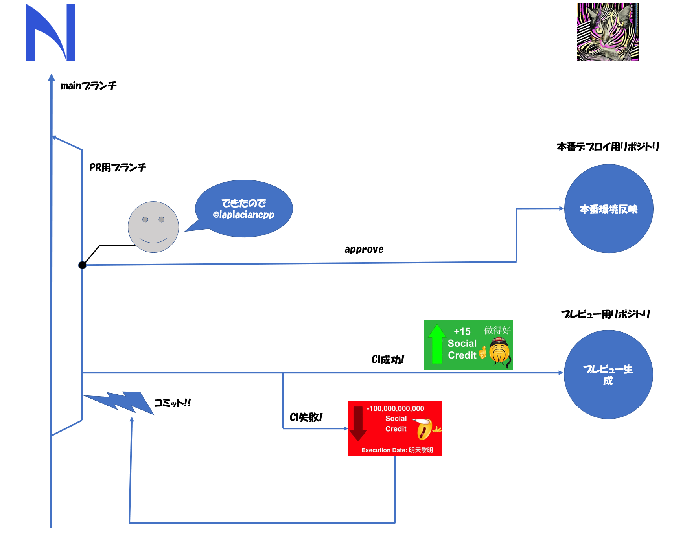

# Nefront-HP

株式会社 Nefront のホームページ([www.nefront.com](https://www.nefront.com/))のミラーリポジトリです．本体は laplacian の private なリポジトリにあります．詳しくは特記事項の章の管理方針の節を見てください．主に Next.js と ChakraUI を用いて作成されています．

# How to run

Install dependencies

```
$ yarn
```

dev でビルド

```
$ yarn run dev
```

# ディレクトリ構成

```
.
├ public: HP内で用いる静的ファイル群
└
```

# 特記事項

## 管理方針

本Organization(NefrontInc)はアップグレードされていない為，privateなリポジトリに対してGitHub Pagesが適用できません．そのため，

## How to contribute

サイトの UI や文言等を変更したい場合は本リポジトリの main ブランチから新規ブランチを生やし，そのブランチ上で中身を変更後，main ブランチに対して PR を作成してください．PR を作成した時点で後述する CI によりプレビュー用サイトが生成され，その URL が PR のコメントに付きます．本 Organization はアップグレードされていないのでドラフトの PR にすることができないため，ひとまず完成したという段階で PR のコメント内で@laplaciancpp にメンションを飛ばしてください．また，CI 内でコードフォーマットのチェックをかけているので package.json 内の

```
$ yarn run format
```

を用いてフォーマット，

```
$ yarn run format:check
```

を用いて正しくフォーマットされているかのチェック

の 2 つのコマンドを適宜用いてください．

以上の概要を示した図が次のものになります:



## CI

本リポジトリには GitHub Actions による CI が含まれており，これは PR 時か main ブランチへのプッシュ時に発火するようになっています．この CI について概要を記述します．

### deploy_preview.yml

別リポジトリに PR のコードでのプレビューを生成し，その URL をコメントに付けます．発火条件は PR が open されたとき，コミットが追加されたとき，reopen されたときです．

open されたときのみ PR にプレビュー用 URL が記載されたコメントが自動で付きます．

### delete_preview.yml

ある PR が閉じたとき，該当のプレビュー用リポジトリを削除します．発火条件は PR が close されたときです．

### deploy.yml

コードフォーマットのチェックとビルド，さらに main ブランチへのプッシュの場合はデプロイまでを行います．

## ウネウネ

トップページには謎のウネウネした物体がフヨフヨしている様子が確認できると思います．これは，[particles.js](https://github.com/VincentGarreau/particles.js/)という VanillaJS な OSS をインチキに書き換えることにより

-   タイプライター部分にパーティクルの侵入を許さない
-   ES6 以降でのコンパイルに対応

を実現しているのですが，これは現状かなり属人的なのでその概要を記しておきます:

### タイプライター部分にパーティクルの侵入を許さない

particles.js では config 用の JS ファイルを particles.js とは別に読み込むことでパーティクルの挙動に対して様々な設定をすることができます．この中にはパーティクルの表示領域(canvas)でマウスホバーするとマウス座標を中心とした正円領域内のパーティクルを外側に追いやるという機能があります．

よってこれをマウスホバーしているかどうかにかかわらずキャンバスの中央を中心とした正円領域内の点を追いやるように改造すればよいです．マウスホバー時に追いやる実装は partices.js の`pJS.fn.modes.repulseParticle`内にあるのでこれを次のように書き換えます:

```diff
pJS.fn.modes.repulseParticle = function (p) {
            if (
                pJS.interactivity.events.onhover.enable &&
-               isInArray('repulse', pJS.interactivity.events.onhover.mode) &&
-               pJS.interactivity.status == 'mousemove'
+               isInArray('repulse', pJS.interactivity.events.onhover.mode)
            ) {
-               var dx_mouse = p.x - pJS.interactivity.mouse.pos_x,
-                   dy_mouse = p.y - pJS.interactivity.mouse.pos_y,
+               var dx_mouse = p.x - pJS.canvas.w / 2,
+                   dy_mouse = p.y - pJS.canvas.h / 2,
                    dist_mouse = Math.sqrt(dx_mouse * dx_mouse + dy_mouse * dy_mouse);

                var normVec = {
                        x: dx_mouse / dist_mouse,
                        y: dy_mouse / dist_mouse,
                    },
                    repulseRadius = pJS.interactivity.modes.repulse.distance,
                    velocity = 100,
                    repulseFactor = clamp(
                        (1 / repulseRadius) *
                            (-1 * Math.pow(dist_mouse / repulseRadius, 2) + 1) *
                            repulseRadius *
                            velocity,
                        0,
                        50
                    );

+               if (pJS.canvas.w / 2 < repulseRadius) {
+                   repulseRadius = pJS.canvas.w / 2;
+               }
```

### ES6 以降でのコンパイルに対応

このまま読み込もうとしても`Uncaught TypeError: 'caller’, 'callee’, and 'arguments’ properties may not be accessed on strict mode functions or the arguments objects for calls to them at Function.Object.deepExtend`が出ると思います．これは argments.callee を使っているために生じるエラーですので callee を用いている無名関数を名前付きにしてやればよいため，ソースを次のように変更します:

```diff
-    Object.deepExtend = function (destination, source) {
+    Object.deepExtend = function deepExtendFunction(destination, source) {
        for (var property in source) {
            if (
                source[property] &&
                source[property].constructor &&
                source[property].constructor === Object
            ) {
                destination[property] = destination[property] || {};
-               arguments.callee(destination[property], source[property]);
+               deepExtendFunction(destination[property], source[property]);
            } else {
                destination[property] = source[property];
            }
        }
        return destination;
    };
```

あとはこの処理をしたモジュールを export，config の JS ファイル内でも同様に export し，next/dynamic に含まれている dynamic import を用いて ssr オプションを false にして読み込むことで CSR な読み込みが実現できて window などが使えるようになります．これを適用したものが本リポジトリに存在するものになります．
